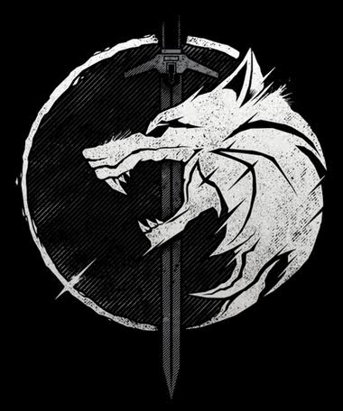

# Estudos profundos no mundo do The Witcher

    

---

**The Witcher** é uma saga que surgiu a partir de um conto chamado <code style="color: orange">O Bruxo</code> lançado em 1986 pelo autor **Andrzej Sapkowski** para um concurso em uma revista polonesa chamada _Fantastyka_.

Como o conto ficou muito famoso (ficou em terceiro na competição) as pessoas queriam saber mais sobre o Bruxo Geralt de Rívia, então o Autor continuou a escrever contros do bruxo e depois começou a escrever um Romance desse mundo.

Os Contos foram reunidos nos dois primeiros livros do autor, que se chamam:

1) <code style="color: red">O último Desejo (Título Original: Wiedzmin - Ostatnie Zyczenie)</code> 
    1. Lançado pela primeira vez em 1993, chegou traduzido ao Brasil em 2011
    2. Contos Lançados:
        1. A voz da razão (dividido no livro em 7 partes)
        2. O bruxo
        3. Um grão de veracidade
        4. O mal menor
        5. Uma questão de preço (conto que mostra o porque do geralt ter a ciri como criança prometida)
        6. Os confins do mundo
        7. O último desejo (conto que uniu Geralt com a Yennifer)
2) <code style="color: red">A espada do Destino (Título Original: Wiedzmin - Miecz przeznaczenia)</code>
    1. Lançado pela primeira vez em 1992 (foi lançado antes do primeiro), chegou traduzido ao Brasil em 2012
    2. Contos Lançados:
        1. O limite do possível
        2. Um fragmento de gelo
        3. O fogo eterno
        4. Um pequeno sacrifício
        5. A espada do destino (conto que da o nome ao livro, onde a ciri se encontra pelo destino com o Geralt)
        6. Algo mais
    3. Frase marcante desse livro: "A espada do destino tem dois gumes... Um deles é você. E o outro é a morte."

Após o Lançamento dos dois livros de contos, que foram um sucesso, Andrzej começou a escrever o Romance principal da história de The Witcher, onde no final do segundo livro ele uniu Ciri ao Geralt permanentemente após a destruição de cintra e no terceiro livro em diante deu origem a história que conhecemos hoje.

Andzej Sapkowsky escreveu 5 romances com os personagens principais (Geralt,Yennefer,Ciri,Triss) que foram surgindo nos contos,onde ele lançou um livro por ano até 1999, onde ele finalizou a história, ou seja, são ao total 7 livros da história inicial.

Os Romances lançados são:

3) <code style="color: green">O Sangue dos Elfos (Título Original: Wiedzmin - Krew Elfow)</code>

4) <code style="color: green"></code>

5) <code style="color: green"></code>

6) <code style="color: green"></code>

7) <code style="color: green"></code>
 
---

    <h1>Vídeos Lançados do Mundo do The Witcher</h1>

---

<h2>Videos dos Jogos do The Witcher</h2>

* [Acesse a página de Videos do The Witcher 3](videos/trailers/trailers-the-witcher-3.md)