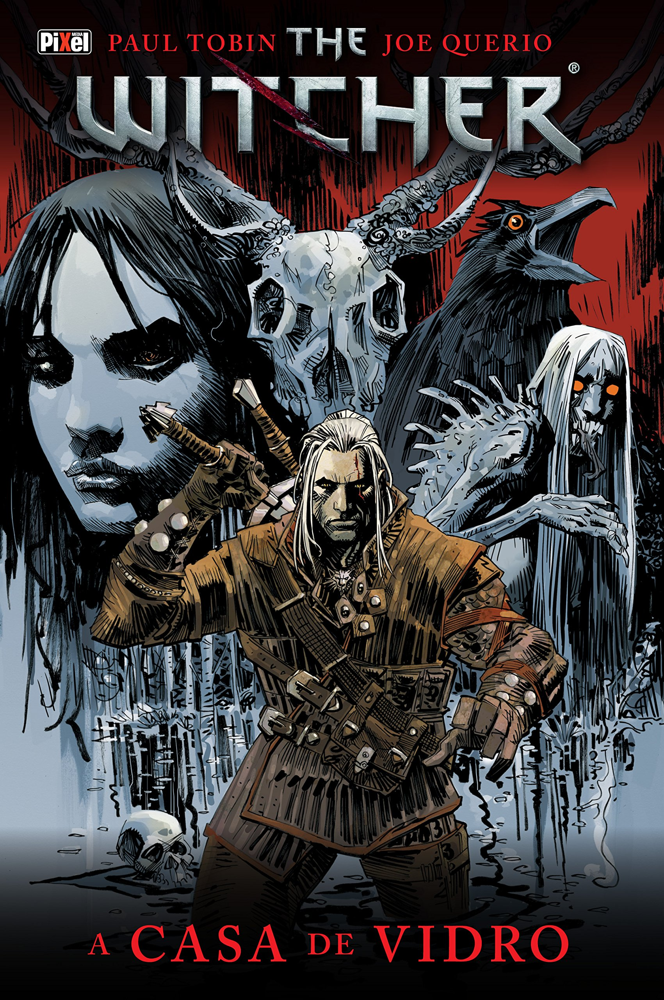

# Estudos profundos no mundo do The Witcher

    

---

    <h1>Os Livros</h1>

**The Witcher** é uma saga que surgiu a partir de um conto chamado <code style="color: orange">O Bruxo</code> lançado em 1986 pelo autor **Andrzej Sapkowski** para um concurso em uma revista polonesa chamada _Fantastyka_.

Como o conto ficou muito famoso (ficou em terceiro na competição) as pessoas queriam saber mais sobre o Bruxo Geralt de Rívia, então o Autor continuou a escrever contros do bruxo e depois começou a escrever um Romance desse mundo.

Os Contos foram reunidos nos dois primeiros livros do autor, que se chamam:

* <code style="color: red">O último Desejo (Título Original: Wiedzmin - Ostatnie Zyczenie)</code> 
    * Lançado pela primeira vez em 1993, chegou traduzido ao Brasil em 2011
    * Contos Lançados:
        
        1) A voz da razão (dividido no livro em 7 partes)
        
        2) O bruxo
        
        3) Um grão de veracidade
        
        4) O mal menor
        
        5) Uma questão de preço (conto que mostra o porque do geralt ter a ciri como criança prometida)
        
        6) Os confins do mundo
        
        7) O último desejo (conto que uniu Geralt com a Yennifer)

<table>
    <tr>
        <th>
            

                
            

        </th>
    </tr>
</table>

* <code style="color: red">A espada do Destino (Título Original: Wiedzmin - Miecz przeznaczenia)</code>
    * Lançado pela primeira vez em 1992 (foi lançado antes do primeiro), chegou traduzido ao Brasil em 2012
    * Frase marcante desse livro: "A espada do destino tem dois gumes... Um deles é você. E o outro é a morte."
    * Contos Lançados:
        
        1) O limite do possível
        
        2) Um fragmento de gelo
        
        3) O fogo eterno
        
        4) Um pequeno sacrifício
        
        5) A espada do destino (conto que da o nome ao livro, onde a ciri se encontra pelo destino com o Geralt)
        
        6) Algo mais

    

Após o Lançamento dos dois livros de contos, que foram um sucesso, Andrzej começou a escrever o Romance principal da história de The Witcher, onde no final do segundo livro ele uniu Ciri ao Geralt permanentemente após a destruição de cintra e no terceiro livro em diante deu origem a história que conhecemos hoje.

Andzej Sapkowsky escreveu 5 romances com os personagens principais (Geralt,Yennefer,Ciri,Triss) que foram surgindo nos contos,onde ele lançou um livro por ano até 1999, onde ele finalizou a história, ou seja, são ao total 7 livros da história inicial.

Os Romances lançados são:

* <code style="color: lightblue">O Sangue dos Elfos (Título Original: Wiedzmin - Krew Elfow)</code>
    * Lançado pela primeira vez em 1994, chegou traduzido ao Brasil em 2013

    

* <code style="color: lightblue">Tempo do Desprezo (Título Original: Wiedzmin - Czas Pogardy)</code>
    * Lançado pela primeira vez em 1995, chegou traduzido ao Brasil em 2014

    

* <code style="color: lightblue">Batismo de Fogo (Título Original: Wiedzmin - Chrzest Ognia)</code>
    * Lançado pela primeira vez em 1996, chegou traduzido ao Brasil em 2015

    

* <code style="color: lightblue">A torre da Andorinha (Título Original: Wiedzmin - Wieza Jaskólki)</code>
    * Lançado pela primeira vez em 1997, chegou traduzido ao Brasil em 2016

    

* <code style="color: lightblue">A senhora do Lago (Título Original: Wiedzmin - Pani Jeziora)</code>
    * Lançado pela primeira vez em 1999
    * No Brasil foi dividido pela primeira vez em 2 volumes lançados em 2017 (primeiro em Junho e o segundo em Novembro)

    

* <code style="color: lightblue">Tempo de Tempestade (Título Original: Wiedzmin - Sezon Burz)</code>
    * Este livro é considerado um Prelúdio (se passa antes da história principal para um desfecho final)
    * Lançado pela primeira vez em Novembro de 2013 na Polônia
    * Lançado no Brasil em 2019

    

---

    <h1>Os Jogos</h1>

Em 2007, um estúdio de jogos poloneses chamada **CD Projekt RED** adaptou a história para os jogos, onde seria uma continuação do que ocorre no último livro lançado pelo autor.

O Autor dos livros em si não recebe nada dos jogos da empresa porque recusou um contrato de sua participação dos lucros.

Foram lançados até o momento 6 jogos, sendo eles:

* <code style="color: gold">The Witcher</code> lançado em 2007

    

* <code style="color: gold">The Witcher - Assassins of Kings</code> lançado em 2012

    

* <code style="color: gold">The Witcher Adventure Game</code> jogo boardgame digital do jogo de mesa lançado em 2014

    

* <code style="color: gold">The Witcher 3 Wild Hunt</code> lançado em 2015

    

* <code style="color: gold">Gwent The Witcher Card Game</code> lançado em 2016 a primeira versão, sendo atualizado até hoje

    

* <code style="color: gold">Thronebreaker: The Witcher Tales</code> primeira expansão do jogo Gwent, sendo um jogo história na mesma estrutura do jogo multijogador gwent, lançado em 2018

    

---

    <h1>RPG de Mesa</h1>

Foi lançado também o jogo de RPG de mesa do The Witcher, onde foram lançados os livros de como jogar o RPG com um grupo de pessoas, podendo expandir a história do mundo de the witcher para além dos limites dos livros e Jogos, onde foram lançados até o momento os seguinte livros para jogar:

* <code style="color: greenyellow">The Witcher Role-Playing-Game, Livro Básico</code> lançado em 2020. livro base para jogar

    

* <code style="color: greenyellow">The Witcher Senhores Feudais</code> lançado em 2020 também. expansão do primeiro livro que traz o escudo do mestre e a raça ananicos e profissão Nobre

    

* <code style="color: greenyellow">The Witcher O diário do Bruxo</code> lançado em 2021. segunda expansão que traz mais informação e dados sobre os bruxos do mundo do the witcher, com um bestiário maior e mair lore sobre como surgiram e como se tornar um deles e muito mais

    

---

    <h1>Série da Netflix</h1>

Netflix lançou em 2019 a série do The Witcher, mostrando a história desde o inicio pelos livros, onde a ideia e trazer toda a história do Geralt de Rívia dos livros para o público das séries.

A primeira Temporada mostra a origem da Ciri,Yennefer e Jaskier na vida do Geralt e a luta diária dele de ser um Bruxo, onde ele vive muito mais tempo que um mero mortal e tem todo um código de vida, onde ele diz que perdeu as emoções devido as provas das ervas que o tornou bruxo, mas podemos ver que ele ainda pode sentir algo.

O Geralt da Netflix é o Grande ator Henry Cavill, que fez o Superhomem do jack snyder, sendo o ator perfeito para o papel porque ele não só tem os jeitos do personagem dos jogos como também é um grande fã das histórias, onde ele ja leu e jogou todos os jogos lançados.

A segunda temporada vai ser lançado no final de 2021, trazendo a história do terceiro livro, mostrando o treinamento da CIRI para se tornar um Bruxo.

    

---

    <h1>História em Quadrinhos</h1>

Tem histórias em quadrinhos que foram lançadas na polonia desde 1993, mas está chegando no brasil somente a recém algumas histórias, vindas para o Brasil pela empresa Dark Horse desde 2014, dentre elas:

* <code style="color: aquamarine">A Casa de Vidro</code> Lançado em 2014

    

* <code style="color: aquamarine">Filhos da Raposa</code> Lançado em 2015

    

* <code style="color: aquamarine">A maldição dos Corvos</code> Lançado em 2018

    

 
---

    <h1>Vídeos Lançados do Mundo do The Witcher</h1>

---

<h2>Videos dos Jogos do The Witcher</h2>

* [Acesse a página de Videos do The Witcher 3](videos/trailers/trailers-the-witcher-3.md)